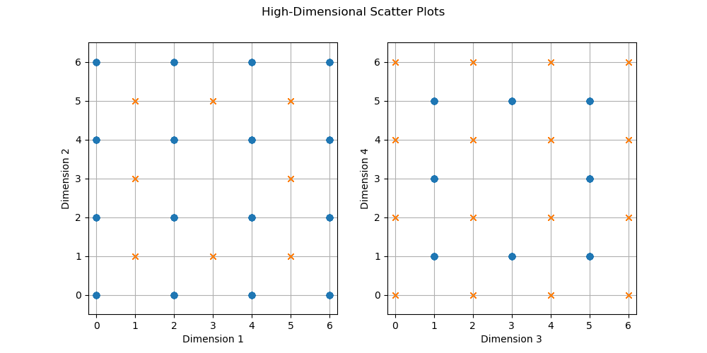
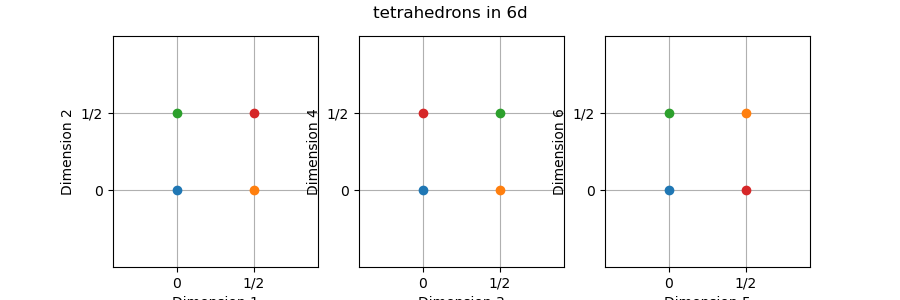
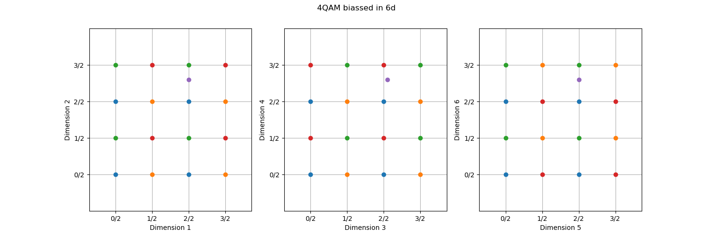

Tadhg's thesis work

# Compelling example

Consider a 16QAM and a rectangular 8QAM constellation. In this document all constellations will be represented with strictly non-negative coordinates so that distance vectors have + and - while coordinate points are always written without the sign. So the constellations in question would look like this:


Both of these constellations exist in 2 spatial dimensions and transmit 4 or 3 bits respectively. If we composed a system where we alternate between using the constellations we might expect to get a net throughput of 7 bits every 4 spatial dimensions.

However, if for every pair of 16QAM and 8QAM points we allow a choice of whether to send the 16QAM first or the 8QAM point first we can extract an 8th bit from this scheme. In this way we can represent the valid codewords in this new hybrid constellation as first picking O (blue) or X (red), then picking any point of that colour on the first graph then picking any point of the same colour on the second graph.



This has the same throughput as the original 16QAM constellation but requires less power to transmit. I will also show that the minimum symbol distance is also still 2 even though it may not seem obvious at first glance.

Imagine we transmit the symbol [1,1,0,4], that is the codeword with x=1,y=1 on the left graph and x=0,y=4 on the right graph. If we experience a noise vector of [+0.7, +0.6, +0.3, +0.1] which has a euclidean distance of about 0.975, we get the black dot as shown on the following graph:


Even though on the left graph the point is closer to the point at [2,2], you can only chose that if you also use a blue point on the right graph. the vector from the valid codeword [2,2,5,1] to the green point is [-0.3,-0.4,-0.7, -0.9] which has a length of about 1.245, further than the original point. Any pair of neighbouring codewords will either differ in a single dimension by +-2 and be equal in the other 3 dimensions, or in all 4 dimensions by +-1.

This also hints at how an optimal decoder could be implemented, we can trivially determine which 'box' the transmitted point is inside (the region seperated by grid lines) and then there are in this case 2 codewords (red and blue) that are viable, we could check the euclidean distance to both and return the closer codeword.

## Geometric interpretation

The example given above using 16QAM and rectangular 8QAM gives a compelling example that can reduce power compared to 16QAM without compremising on nearest symbol distance or throughput but doesn't give clear understanding on how this example was determined or how to generate other viable schemes. In this section I will explain the way I first thought about this system in terms of geometry. If we start with 1D where we have the points (0) and (2), the midpoint (1) is 1 unit away from both points. In 2D we have a square with the corners (0,0),(0,2),(2,0),(2,2) and the center at the coordinate (1,1) is going to be sqrt(2) distance away from the corners.

In 3D we can similarly create a cube with the center at (1,1,1) which will be sqrt(3) away from the corners, and in 4D the distance of the center to the corners is sqrt(4)=2. This means that in 4D the distance from the center of a hypercube is the same distance as the corners to each other. Since QAM is based on this type of orthogonal grid, it means that in 4D there is enough space to fit a whole extra codeword in the middle of other ones that doesn't comprimise on minimum symbol distance.

There are 2 interesting results from this, the first is that the point in the middle of of a N-dimensional box of side length 2 is sqrt(N), so as the dimensionality increases the space between codewords in an orthogonal grid like QAM increases as the dimensionality increases so if the only requirement is to maintain the minimum symbol distance and to preserve the original grid structure, we can expect to continue to pack more points into the surrounding space.

The second interesting result is that an inifinite lattice in 4D, each codeword has 24 nearest neighbours which is the densest possible structure in 4D. To show this result, imagine the original hypercube. The point in the middle will has all 16 vertices as nearest neighbours
 (each coordinate differs by +-1 in any combination of +s and -s) and in an extended lattice there are valid codewords by differing a single dimension by 2, so (+2,0,0,0), (-2,0,0,0), (0,+2,0,0), (0,-2,0,0), (0,0,+2,0), (0,0,-2,0), (0,0,0,+2), (0,0,0,-2) which is 8 additional

## A more systematic structure for transmission

So far I've shown a structure that is good for transmission but can't easily be extended and shown the underlying 4D lattice is optimal in terms of density, but this doesn't show a clear way to extend to other constellations. For more systematic constellation design I will only create latices that have nearest neighbour of 1 unit and use 4QAM as my 'seed' constellation. By using a 4QAM constellation and optionally shifting all 4 dimensions by 1/2 units we get a mapping that looks like this:


This will transmit 5 bits every 4 dimensions and every point is at least 1 unit away from any other point, either a single dimension shifting by 1 or all 4 dimensions shifting by 1/2. 

### Decoding

As long as the received vector is within the convex hull of the constellation it is trivial to determine which 'box' (region seperated by grid lines) the received vector is in as it is solely determined by the integer part of the vector coordinates, then we could enumerate all the valid codewords that touch that box which in the 4D case would be a red codeword and a blue codeword and then check which of those viable codewords are closer. Better decoder designs may exist but this is the approach used in my research. When a vector is outside the convex hull of the constellation currently I am brute-force checking all points in the constellation as I haven't analysed more efficient techniques yet. 


## extending to higher dimensions

In 4D we essentially have 1 bit that contributes to the 'bias' of our seed. In 6D we can create 4 possible biasses giving us 2 bits of biassing: (the colours are for the next figure)

- [+0,+0,+0,+0,+0,+0] (blue)
- [+1,+0,+1,+0,+1,+1] (orange)
- [+0,+1,+1,+1,+0,+1] (green)
- [+1,+1,+0,+1,+1,+0] (red)

This corresponds to a linear binary code with minimum hamming distance of 4 and generating matrix of

- 101011
- 011101

which have been chosen specifically to be easy to visualize when plotting as a series of three 2D plots:



This could be used as a constellation of its own, effectively transmitting 2 bits every 6 dimensions, but the advantage is that this can be layered on top of existing QAM constellations like the previous examples. Using the 4QAM seed we can get a constellation such as this:


You may notice this mapping looks a lot like 16QAM, so our 8bit/6D constellation could be interpreted as a block encoding on 12bit/6D of 16QAM with rate of 8/12=2/3. However unlike block codes that primarily use hamming distance to decode a transmitted signal this mapping is structured in a way that would allow efficient and more optimal decoding as I will demonstrate below.

For the demonstration I will use 4QAM as our seed instead of 16QAM we get a smaller constellation which can simplify the example.



Our transmission strategy will send 8 bits, the first 6 get mapped to each dimension individually multiplied by 2, then the last 2 are used to generate a bias vector using the above linear code and added to the coordinate found by the first 6 bits. So the message (11111100) correspond to the blue point at (3,3,3,3,3,3).

So we will treat this as a 16QAM constellation with grey mapping (**TODO: add binary labels to the points**) 
If our grey mapping maps the vector coordinates to bit sequences: 0->00, 1->01, 2->11, 3->10. so our codeword at (3,3,3,3,3,3)/2 corresponds to the 16QAM message of [1111 1111 1111].

Then suppose our noise vector is [0, +0.3, +0.05, +0.3, 0, +0.3] resulting in the purple point in the above figure. Decoding as 16QAM it will be very certain the byte sequence is 1110 1110 1110, this is not a valid codeword but the middle graph's X position (dimension 3) can vary to get 2 other valid codewords that are both green.

- 1110 0110 1110 at coordinate (2,3, 1,3, 2,3)/2
- 1110 1010 1110 at coordinate (2,3, 3,3, 2,3)/2

Both of these codewords only vary from the received code by only 2 bits while the original transmitted message differs by 3 bits, however the euclidean distance to the original codeword is closer than both green points. If we calculate the distance from the point (2,3,3,3,2,3)/2 we get:

```
   (2, 3  , 3  , 3  , 2, 3) 
 - (2, 2.6, 2.1, 2.6, 2, 2.6)
 = (0, 0.4, 0.9, 0.4, 0, 0.4)
 length is sqrt(3*0.4^2 + 0.9^2) = sqrt(1.29)
```

Where as the length of the noise vector to the original message is sqrt(3*0.6^2 + 0.1^2) = sqrt(1.09). This shows that the codeword with closest hamming distance is not necessarily the same as the codeword with closest euclidean distance. The goal of this research is to analyse structures where we can quickly determine a relatively small set of viable codewords to check using euclidean distances.

### biassing in higher dimensions

In any arbitrary dimensionality N, we can find a linear binary code with minimum hamming distance 4 - a code with parameters (N,k,4) for some k - then we can make a new transmission scheme of N+k bits where the first N bits are mapped to each dimension directly (coordinate 0 or 1) and the remaining k bits are fed through the (N,k,4) binary code and the resulting binary vector is halved (mapped to coordinates 0 and 1/2) and added to the coordinate from the N bits. this will produce a structure much like a block code applied to 16QAM.

For instance in 8 dimensions we can use this (8,4,4) code:

- 1000 0111
- 0100 1011
- 0010 1101
- 0001 1110

to produce a 12 bit / 8D code such as this:


The first 8 bits of a message map directly to shifting each of the 8 dimensions, then the first 2 bits of the modulation determine the color (00=red, 01=blue, 10=orange, 11=green) and the second 2 bits determine shape (00=circle, 01=star, 10=square, 11=diamond) to determine where the specific codeword that is transmitted is located.

## Higher order modulation.

When we get up to 16 dimensions we have yet another oppertunity. Similarly to how we could fit a new point in a 4D hypercube, in 16 dimensions the coordinate with all 16 entries of 1/2 will be 2 units away from the origin as well as every possible point that falls on a lattice point from the first order modulation used above. This means we can layer this independently using the exact same construction as a lienar block code with minimum distance of 16 in however many dimensions we have.

So we can imagine a constellation in N dimensions by taking the first N bits and map them to a 4*I generating matrix, that is each element when set to 1 moves in the corresponding dimension 4 units. Then the next set of bits use a linear block code of distance 4 and size N to determine which dimensions to move 2 units in. Then a third layer with size N and distance 16 that moves in 1 unit. This becomes a lattice consistent with 64 QAM and forms an extremely dense lattice. (now that we doubled the lengths so we didn't have to deal with lengths of 1/2 every lattice point is 4 units away instead of 2 as it was previously) this construction still strictly maintains the property that every single codeword is a minimum of 4 units away, equivelent to our original 4QAM constellation but our throughput can achieve comparable rates to 2/3 of 64QAM.

A specific case is that in 128 dimensions using Reed–Muller code, the block length is 2^m so m=7, for the first order modulation r=m-2 such that the minimum distance of 2^(m-r) gives 2^(m-(m-2)) = 2^2 = 4 and for the second order modulation r=m-4 so that the min distance is 2^4=16, and with a 4QAM seed we also get k=2^m=128 since we encode a bit on each dimension. if we calculate the aggregate k values of all three layers we get:

m=7, k=2^m + (sum from a=0 to m-2 of (m choose a)) + (sum from a=0 to m-4 of (m choose a))
k = 312

Compared to 128*3=384 bits that the underlying 64QAM constellation transmits unencoded. this makes our block code have a rate of 13/16 for the 128 dimension case.

### note about vector spacing and notation

Originally when talking about just the first order modulation where it differed 4 dimensions at a time, I used the 1-dim movements as 2 and the 4-dim movements as 1 so they both have a length of 2. Then I went and changed it so that when we have the 2nd order modulation it instead has the 1-dim movements of 4, 4-dim movements of 2 and 16-dim movements as 1, and the 64 dim movements, 256-dim movements do exist and it'd be inconvinient to have to change how we represent the basis every time but also using fractional numbers is a pain. I logically think of the constellation as existing strictly in the bound [0,2) where the 1-dim movements go 1 of the way, the 4-dim movements go 1/2, the 16-dim movements go 1/4 etc. As you add higher and higher modulations it converges to fill the entire region with every rational number with a power of 2 as the denominator gets hit.  This makes me think vaguely of polar codes and how they recursively define rules but I don't know nearly enough about those to comment on whether this is similar at all. It also extends very naturally to using higher QAM as the seed since the integer part will directly correspond to the underlying single dimensional constellation and the fractional part corresponds to the modulations from my construction.


## reason I think this is useful at all and is worth something.

To my understanding, modern block codes do not consider the underlying constellation used to transmit them and this seems like a flaw. I know in my information theory course we proved that an optimal constellation and an optimal error encoding scheme jointly optimized cannot possibly give better results than optimizing them independently, and also that any constellation will tend towards gaussian as the dimensionality increases and therefore pretty much any constellation design is roughly equivelent and I feel like this is the logic for why people just kept using QAM. However if block codes don't consider the underlying transmission technique they may map valid codewords that may be far hamming distance but the physical distance of the codewords can be quite close and therefore the error rate for those symbols is worse. With a scheme with 2^200 codewords that maybe only a small fraction have bad structure because they happen to be close isn't a huge issue, but it certainly isn't optimal. I don't need to claim my scheme is any more optimal, I'm sure a real system will need additional block codes applied on top of it to have the redundency desired which runs into the same issue, but having a system that actually achieves the goal that global minimum physical distance between codewords is the minimum of every possible pair of nearest neighbours feels like a very good property for a transmission scheme to have.


Also I'm pretty sure this scheme will work much better in high SNR environments, the length of a gaussian noise vector in N dimensions follows a chi distribution which has the mean shift as the dimensionality increases, with high SNR if the majority of that distribution falls within the minimum neighbour distance the probability of error should go down much faster than other encoding schemes that don't have uniform distances between symbols.

### isometries

It is also possible that if we can prove isometries of the neighbouring vectors fall into only a few groups i'd significantly simplify the effort required to calculate an exact analytic solution for a strict upper bound on the symbol error rate.

If we have a set of all possible neighbouring vectors (from any given codeword all the nearest neighbours will be found at a subset of that list and every vector in the list is used for at least one point in the constellation) and can prove that one vector is isometric to every other (considering the set of all possible rotations/reflections/ unitary transformations of space that map the set of vectors back to the same set of vectors) then it should prove that the boundary of correct symbol detection - assuming a dense infinite lattice - would be the equivelent of a regular polyhedron in N dimensional space. This would mean the hyperplane bisector of one such vector which defines the boundary that a vector will be decoded as one or the other should have a regular polygon shape uniquely defined by the shared neighbours, if you connect that regular N-1 polyhedra to the original coordinate you get a N dimensional equivelent of a polygonal cone. Taking an integral over the noise vectors for that volume gives the probability of receiving a point within that volume due to a particular noise model, then if we proved that every neighbour is isometric to any other we just multiply this probability by the number of neighbours to obtain the exact probability of correctly decoding the transmitted symbol within an infinite lattice. Since edges of the lattice are more likely to decode the correct symbol when the noise is pointed outside the lattice entirely, this would be a strict lower bound on the probability of correctly decoding the transmitted symbol and therefore gives us a strict upper bound on the probability of symbol error as an analytic solution.

This volume calculation could be done regardless of isometries but unless all vectors are isometric to each other you cannot just multiply by the number of neighbours you'd have to at least do that volume calculation for each class of isometries. Since it is a very regular lattice I wouldn't expect the isometries to be any more classes than the number of layering modulation schemes but this is way beyong what I am capable of actually checking at this point. :P


# Things to further investigate

the way I am generating lattice points has very similar structure to points in the [kissing numbers table][kissingnumbertable]  (the downloadable list of points) I know I found [a paper][kissingnumberpaper] that uses linear block codes and a very similar construction to my construction where they are just trying to find points around the origin where as I am trying to find a valid lattice, but it might be true that putting their lattice points inside a modulo space gets to the exact same thing, although theirs is slightly different since it has 2 points differing by the highest number.

- look more into that paper's construction and whether it can be generalized to a block code directly for maximum adjacency.
- look into papers that reference that paper that may relate to creating block codes based on the idea of having high packing. It is very possible someone else has done something like this.
- figure out more optimal block codes for specifically 24 dimensions since the exact optimal kissing number is known for that and if I ahve first and second order modulation and with optimal block codes it hits the kissing number I can be damn sure this is on the right track.
- look into lattice codes, get a comparison and try to understand motivation behind them as they may relate to my construction.
- use the [Griesmer bound][Griesmer_bound] to calculate what the optimal transmission would be at any given dimensionality, make a plot.
- figure out whether I could calculate the number of neighbour vectors without actually knowing the vectors, just by knowing the size of the block code. Be useful to compare to the theoretical max of the kissing number.

# TODO FOR THIS DOCUMENT

- figure out how to formalize with variables and math etc the higher order modulation system.

hello this is equation
$$\sqrt{3}$$
and stuff stuff

[kissingnumbertable]: https://cohn.mit.edu/kissing-numbers
[kissingnumberpaper]: https://www.combinatorics.org/ojs/index.php/eljc/article/view/v5i1r22/pdf
[Griesmer_bound]: https://en.wikipedia.org/wiki/Griesmer_bound


123456789012345678901234

111100000000000000000000
110011000000000000000000
101010100000000000000000
000011110000000000000000
000011001100000000000000
000010101010000000000000
000000001111000000000000
000000001100110000000000
000000001010101000000000
000000000000111100000000
000000000000110011000000
000000000000101010100000
000000000000000011110000
000000000000000011001100
000000000000000010101010
000000000000000000001111
100010001000100000000000
000000001000100010001000

<!--


# modular space and representations.

**NOTE: I realized I am reinventing the wheel here,** I am just defining linear block codes with distance 4. My system isn't nearly as good as modern codes like Reed–Muller codes, that one ends up with 2^m - m - 1 basis vectors in 2^m dimensions which is better than my about 0.75*M in M dimensions. I can likely swap out my code with a modern one to get better results, the interesting part that I really care about is when we add on a second level of modulation later on.


For the rest of the document I wish to move away from the part where the bias vectors are applied to a QAM mapping. To accomplish this we will analyse the bias vectors in modulo 2 space, this is a valid approach since in general we are duplicating each bias vector by 2 units along each dimension in both direction in the general case when we layer it on top of a QAM constellation. I will also start using bit strings to represent the bias vectors as this is closer to the way it will eventually be implemented.

In 4d we have our first viable bias vector of 1111. in 6D we can get the 4 points:

- 000000
- 111100
- 110011
- 001111

(if we shuffle around the bits this gives the vectors used in the above example, I wish to lay them out like this moving forward)

the vector 111100 is the same as our original 4d case and if we XOR it with the vector 110011 we get the last vector. This means we can map our 2 bits for biassing to the vectors 111100 and 110011, xor the result and that gives us a valid final bias vector.

In 7D we can add another bias basis vector:

- 1111000
- 1100110
- 1010101

The only property we wish to preserve is that each basis vector differs from each other basis vector by at least 4 bits, this gives us 8 possible bias vectors which because each of the basis vectors vary by 4 bits from each other are guarenteed to also vary by 4 bits from each other. I know this could be proven but I'm not sure how to write it formally.

#### side tangent for geometry

To have N points all equal distance away from each other we need N-1 dimensions. This corresponds to a pair of points in 1d, a triangle in 2d, a tetrahedron in 3d etc. I'm not sure how to prove it but I know if you have N dimensions you can have the vectors [1,0,0,0,0], [0,1,0,0,0], etc. where all coordinates are 0 except one is 1 and with N dimensions you get N points, I feel like you could then build a matrix out of the difference vectors and show it has rank N-1 which implies the shape with that many points could exist in N-1 dimensional space but I'm not sure how to formalize this yet.

#### back to the 7d case.

Since our 3 basis vectors form 8 points in 7D space that are all equal distance from each other, using the logic shown in the side tangent this is the most connectivity we could expect. As we expand further we expect to put 16 points in less than 15 dimensions so moving any further will require not all the points we generate to be densely adjacent.

In 8D we have our 4th basis vector and it shows a repeating pattern into higher dimensions:

- 111100000...
- 1100110000...
- 10101010000...
- 000011110000...
- 0000110011000...
- 00001010101000...
- 000000001111000...
- 0000000011001100...

I do not have a proof that this is the optimal pattern given the constraint that each must be different by at least 4 elements from each other and we compare them in modulo 2 space but it does work. It also produces the first non densely connected bias vectors as 11110000 and 00001111 are disjoint.

-->